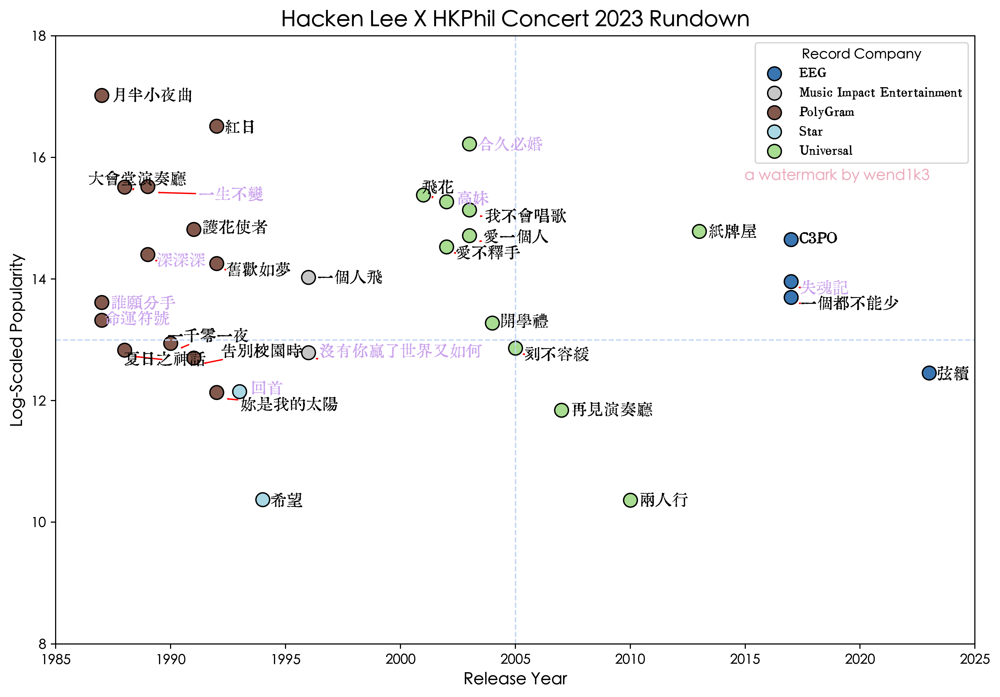
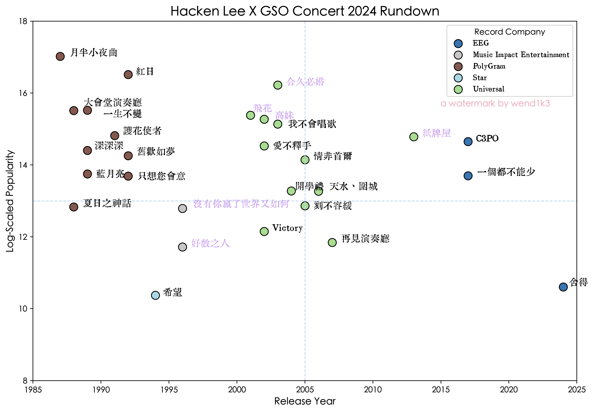
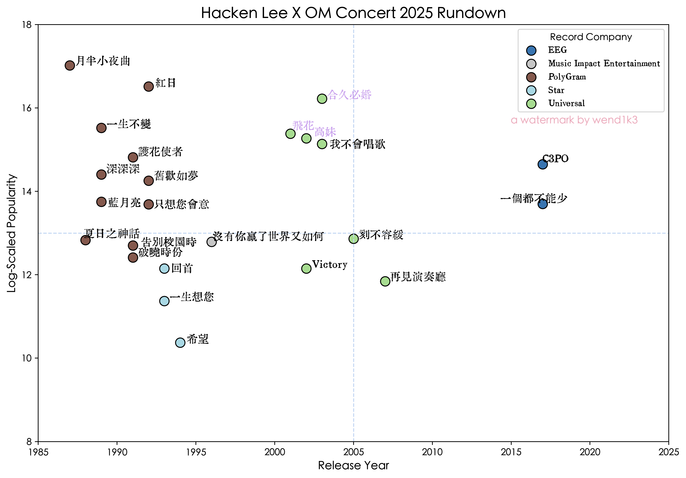

# Setlist Analysis of Hacken Lee's Three Themed Concerts Using Spotify Data
 &emsp; 
 

This project analyzes the setlists of three Hacken Lee concerts that share a common theme — 「弦續」, meaning "continuation". By combining Spotify audio features, track metadata, and concert structure, the project reveals patterns in setlist design across locations and time.
## Project Overview
Using data retrieved via the **Spotify Web API** (accessed through the `Spotipy` Python library), this analysis investigates:
- <em>How are hit songs and lesser-known sidetracks balanced across the setlists?</em>
- <em>Which albums are most favoured?</em>
- <em>How do the setlists vary across different concert locations?</em>

## Motivation
Hacken Lee is a renowned Cantopop artist whose career spans from the 1980s to the 2020s, with continued success and regular album releases. As a fan and data enthusiast, I was curious to understand how a veteran artist balances musical legacy and audience expectations through data-driven analysis.

These three concerts — though held in different regions and under slightly different names — share a unified theme and orchestral collaboration. The consistency provides an ideal basis for comparative analysis.

## Technologies
- Python
    - Spotipy
    - pandas / NumPy
    - matplotlib
- Jupyter Notebook

## Data Sources
- **Spotify Web API** for metadata
- Manual setlist collection

## Files
- [report_eng.ipynb](report_eng.ipynb) : full Jupyter notebook with analysis, charts, and commentary
- example cleaned dataset files are stored inside `/dataset` folders

## Visuals
### Quadrant Chart

### Bar Chart

## Future Work
- Expand to include more concert over time
- Interview fans or integrate fan polls for subjective comparison